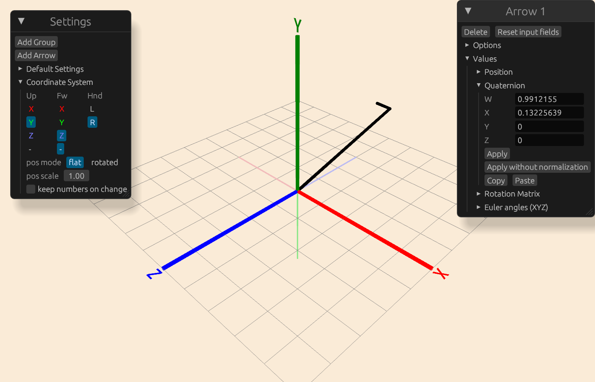

# quaternions-offline

Kinda like [quaternions.online](https://quaternions.online) except offline. And also with configurable coordinate system and multiple objects.

But also [online](https://epsylon42.github.io/quaternions-offline/) (~10Mb, so loading time may be suboptimal)

